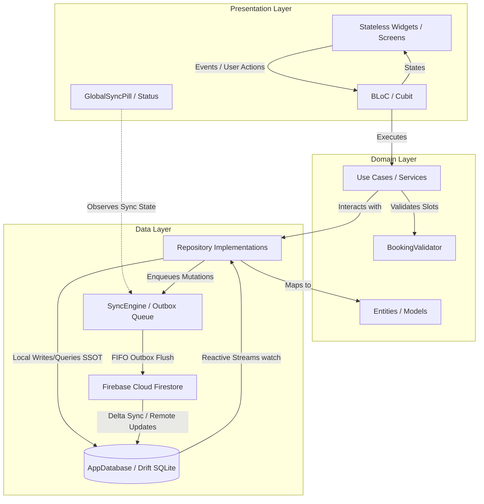

# 🩺 DentalConnect (appoint_dent)

<div align="center">

[](https://flutter.dev)
[](https://dart.dev)
[](https://bloclibrary.dev)
[-4CAF50?style=for-the-badge&logo=sqlite)](https://drift.simonbinder.eu)
[](https://firebase.google.com)
[](tests/security_rules/README.md)
[](test/) 
[](#-license--maintainer)

**An Enterprise-Grade Dental Practice Management Platform & Multi-Tenant Scheduling System**

*Engineered with Flutter, Clean Architecture, BLoC Pattern, Local-First Drift/SQLite Engine, Firebase Cloud Backend, and Zero-Trust Security.*

[Key Features](#-key-features) • [Offline-First Architecture](#-offline-first--local-first-architecture) • [System Architecture](#-system-architecture) • [Project Structure](#-project-structure) • [Cloud Functions](#-backend-cloud-functions) • [Getting Started](#-getting-started) • [Deployment](#-deployment) • [Live Portal](https://dental-94235.web.app)

</div>

---

## 📖 Overview

**DentalConnect** (`appoint_dent`) is an enterprise-grade multi-platform application designed to streamline modern dental clinic operations. It provides an ultra-responsive mobile experience for dentists and clinical staff operating in real-world clinic environments, alongside a high-performance **Web Admin Dashboard** for managing multi-tenant clinics, subscriptions, system logs, announcements, and patient records.

The platform relies on a **Local-First (Offline-First)** architecture built with **Drift (SQLite)**, **Clean Architecture**, and **BLoC (Business Logic Component)** state management. The local database acts as the single source of truth for the presentation layer—ensuring zero clinic downtime during Wi-Fi drops or X-ray room shielding, immediate sub-5ms UI responsiveness, and background synchronization via a Transactional Outbox Engine.

---

## 🚀 Key Features

### ⚡ Offline-First & Local-First Architecture (Drift SQLite + Reactive Sync Engine)
- **Single Source of Truth (SSOT)**: Local SQLite database (`AppDatabase` via `drift`) serves all UI queries instantly (1–5ms latency), completely insulating the clinic workflow from network latency or cloud timeouts.
- **Transactional Outbox Sync Engine (`SyncEngine`)**:
  - Autonomous FIFO queue processing all pending entity mutations (`CREATE`, `UPDATE`, `DELETE`) with UUID v4 idempotency keys.
  - Entity-specific sync handlers: `PatientSyncHandler`, `AppointmentSyncHandler`, and `BillingSyncHandler`.
  - Exponential backoff with jitter and retry counter to prevent cloud throttling.
  - Delta synchronization comparing entity modification timestamps (`updatedAtMs`).
- **Resilient Connectivity Detection (`NetworkConnectivityService`)**:
  - Continuous network monitoring with active DNS ping fallback (`dns.google`) to identify and overcome "Lie-Fi" conditions (connected to Wi-Fi without internet throughput).
- **Global Sync Status Indicator (`GlobalSyncPill`)**:
  - Real-time reactive status pill: 🟢 **Synced** (Cloud synchronized), 🟡 **Offline/Pending** (Queued changes count), and 🔴 **Conflict** (Slot conflict requiring review).
- **Interactive Conflict Resolution (`ConflictResolutionDialog`)**:
  - Visual side-by-side reconciliation interface for concurrent offline double-bookings, enabling doctors to reschedule time slots, reassign practitioners, or cancel conflicting appointments without data loss.
- **Sync Queue Management (`SyncQueueScreen` & `FinancialSyncQueueScreen`)**:
  - Dedicated diagnostic screens for clinic administrators to inspect pending outbox operations, view error logs, trigger manual synchronization, or clear retry counts.
- **Optimistic UI Badging**:
  - Real-time cloud sync badges rendered directly on `AppointmentCard` (synced, pending cloud upload, or collision alert).
- **Comprehensive Offline Documentation**:
  - Offline-First Architecture Plan: Detailed RFC and technical specification.
  - Offline-First Study Guide: 3-week implementation curriculum and developer roadmap.

### 🎓 Interactive Guided Tutorials & Clinic Onboarding Guidance System
- **Step-by-Step Guided Tours**: Multi-step interactive walkthroughs (`lib/features/tutorials/`) designed to rapidly onboard doctors and clinic receptionists.
- **Category Filtering & Collapsible Sections**:
  - Dedicated filtering chips (`All`, `Appointments`, `Patients`, `Finance`, `Settings`, `Overview`) with collapsible category accordions in `TutorialListScreen`.
- **Spotlight Cutouts & Custom Tooltip Bubbles (`TutorialTooltipBubble`)**:
  - Dynamic overlay highlighting targeted UI components with darkened backdrops, pointing arrows, step counters, skip/next/previous controls, and animated indicators.
- **Quick-Access Help Tour Button (`HelpTourButton`)**:
  - Floating and AppBar action button allowing users to trigger context-aware guided tours directly from any screen.
- **Dynamic Bilingual Localization**:
  - Fully translated tutorial titles and descriptions via `tutorial_localization_extension.dart` supporting English and Arabic ARB keys.
- **Persistent Progress Tracking**:
  - Lesson completion status persisted locally across app sessions with visual checkmarks and drawer integration.

### 📅 Advanced Appointment, Weekly Schedule & Range Booking Engine
- **Refactored Weekly Schedule Timeline (`WeeklyScheduleScreen`)**:
  - Intuitive weekly timeline view with smooth day switching, appointment navigation handling, and slot conflict warnings.
- **Single & Range Slot Reservation**: Flexible booking supporting standard 30-minute slots as well as continuous multi-hour custom time ranges (`startTime`, `endDateTime`, `durationMinutes`).
- **Conflict Prevention Engine**: Real-time slot overlap verification powered by an automated `BookingValidator` service prior to database writes.
- **Interactive Visual Calendar**: Multi-view appointment management using `calendar_date_picker2` with visual slot status indicators.
- **Automated Notifications**: Local and scheduled appointment reminders via `flutter_local_notifications` and `timezone`.

### 📢 Admin Broadcast Announcements & Cloud Notification Pipeline
- **Bilingual Broadcast Announcements**: Super Admin announcements with full bilingual support (`titleAr`/`titleEn`, `messageAr`/`messageEn`, `actionLabel`, `actionUrl`).
- **Automated Cloud Functions Pipeline**: Firestore `onCreate` trigger (`sendAdminBroadcastNotification`) dispatches high-priority push notifications across FCM topics (`all_clinics`, `pro_clinics`, `basic_clinics`, `free_clinics`) with Android notification channels and iOS APNs payloads.
- **In-App Inbox & Dashboard Banners**: Responsive announcement banners on the mobile dashboard with a dedicated in-app announcements inbox screen.
- **Persistent Banner Dismissal**: Dismissal state stored via `SharedPreferences` so dismissed announcements do not reappear on dashboard navigation or app restarts.
- **Smart Deep-Linking (`NotificationNavigator`)**: Intelligent routing handling external web URLs, in-app destinations, and admin route presets with fallback handling.

### 🛡️ Route Guards & Subscription Entitlement Control (`GoRouter`)
- **Centralized Declarative Routing**: Unified route management using `go_router` with dedicated `/finance` and `/billing` routes.
- **Subscription & Settings Route Guard**: Automated `isFinanceFeatureAccessible` check verifying both `isFinanceEnabled` (clinic settings toggle) and `canAccessFinance` (subscription tier / free plan validation).
- **Graceful Redirection & Warning Toasts**: Attempts to access financial modules while disabled or on a free plan automatically redirect to `/settings` with informative `NotificationToast.warn` alerts.

### 🔐 Zero-Trust Security & App Hardening
- **Multi-Tenant Authentication**: Firebase Auth supporting Email/Password, OTP, and Google Sign-In with clinic-isolated tokens.
- **Firebase App Check Integration**: Cryptographic request attestation (`AppCheckManager` via `firebase_app_check`) preventing unauthorized API access and bot traffic.
- **Biometric Security Gate**: Device-level biometric authentication (`BiometricSecurityGate` with `local_auth`) for sensitive administrative actions.
- **Network Layer Hardening**: Custom `SecurityHttpClient` enforcing secure transport parameters and payload integrity.
- **Encrypted Local Storage**: Sensitive credentials and auth tokens persisted via `flutter_secure_storage` with hardened iOS Keychain (`first_unlock_this_device`).
- **Verified Firestore Security Rules**: Row-level tenant isolation, clinic ID immutability, role privilege boundaries, and immutable audit logs verified by an **81-assertion automated test suite** (`tests/security_rules/`).

### 💳 Billing, Payments & Invoicing
- **Flexible Payment Recording**: Support for full, partial, and bulk payment processing in `BillingBloc`.
- **Treatment Confirmation Workflow**: Multi-step treatment verification and ledger tracking.
- **Financial & Excel Export**: Automated generation of clinic revenue, billing reports, and schedules exported into `.xlsx` spreadsheets via `syncfusion_flutter_xlsio` and native cross-platform file opening via `open_app_file`.
- **Offline Financial Support**: Append-only payment transactions with UUID v4 idempotency keys preventing duplicate billing upon cloud sync.

### 👥 Patient & Clinic Operations
- **Patient Medical Histories**: Comprehensive patient profiles, demographic tracking, and treatment logs.
- **Sub-Millisecond Patient Search**: Local SQLite full-text search (`searchPatients`) by patient name or phone number without network dependency.
- **Multi-Clinic Data Isolation**: Tenant-specific access control ensuring zero cross-clinic data leakage.
- **Interactive Dashboards**: Interactive charts and data visualizations powered by `fl_chart`.
- **Global Localization**: Native English and Arabic (RTL) support utilizing `easy_localization`.

### 🖥️ Dedicated Web Admin Dashboard
- **Web-Optimized Entry Point**: Modular architecture running on `lib/main_admin.dart` and `lib/main_admin_dev.dart`.
- **Clean URLs**: Configured with `usePathUrlStrategy` for path-based browser URLs without `#` hash fragments.
- **System Administration**: Admin controls for registering clinics, managing tier-based subscription plans, broadcasting announcements, and auditing actions.


---

## 🏗 System Architecture

The application adheres strictly to **Clean Architecture** combined with the **BLoC pattern** and a **Local-First (Offline-First)** data persistence model:



### Architectural Principles Applied
1. **Local-First Single Source of Truth (SSOT)**: The presentation layer reads and observes local Drift/SQLite tables. User interactions never block on remote cloud roundtrips.
2. **Transactional Outbox Pattern**: Entity modifications are recorded locally and simultaneously written to the `sync_queue` table within an atomic database transaction.
3. **No UI-Logic Mixing**: UI components are immutable `StatelessWidget` instances. All presentation logic is delegated to BLoCs/Cubits.
4. **Dependency Inversion**: Dependencies are registered centrally in `lib/core/dependency_injection/` using `get_it`. Repositories expose abstract interfaces in the Domain layer.
5. **Strict Pre-Commit Validation**: All appointment creation requests pass through a dedicated `BookingValidator` service to mathematically verify non-overlapping schedules before committing to local or remote storage.
6. **Immutability & Value Equality**: Domain models, Events, and States implement `Equatable` or `json_annotation` for predictable state rebuilds.

---

## 🛠 Tech Stack & Dependencies

| Category | Technologies / Packages |
| :--- | :--- |
| **Framework & Language** | Flutter SDK `^3.41.1`, Dart SDK `>=3.3.0 <4.0.0` |
| **State Management** | `flutter_bloc` `^9.1.1`, `bloc` `^9.1.0`, `rxdart` `^0.28.0` |
| **Local Database & Offline**| `drift` `^2.24.0`, `drift_flutter` `^0.2.3`, `sqlite3_flutter_libs` `^0.5.28` |
| **Resilience & Networking** | `connectivity_plus`, `uuid` `^4.5.1`, `dio` `^5.9.0` |
| **Dependency Injection** | `get_it` `^9.0.5` |
| **Navigation & Routing** | `go_router` `^17.3.0` |
| **Backend & Cloud Services** | Firebase Auth, Firestore, Firebase Storage, Firebase Database, Crashlytics |
| **Security & App Protection**| `firebase_app_check`, `local_auth`, `flutter_secure_storage`, `safe_device` |
| **Localization & Formatting** | `easy_localization` `^3.0.8`, `intl` |
| **UI Components & Charts** | `fl_chart`, `calendar_date_picker2`, `responsive_sizer`, `skeletonizer`, `lottie` |
| **Export & Reporting** | `syncfusion_flutter_xlsio`, `syncfusion_officechart`, `open_app_file` |
| **Code Generation** | `build_runner`, `drift_dev`, `json_serializable` |

---

## 📂 Project Structure

```
.
├── lib/
│   ├── main_dev.dart                    # Development entry point (Mobile app)
│   ├── main_prod.dart                   # Production entry point (Mobile app)
│   ├── main_admin.dart                  # Production Web Admin entry point
│   ├── main_admin_dev.dart              # Development Web Admin entry point
│   ├── app.dart                         # Primary mobile application root
│   ├── firebase_options_dev.dart        # Firebase credentials (Development environment)
│   ├── firebase_options_prod.dart       # Firebase credentials (Production environment)
│   │
│   ├── admin/                           # Web Admin Portal Module (Enterprise SaaS)
│   │   ├── admin_app.dart              # Web Admin root widget & routing
│   │   ├── core/                        # Admin-specific themes, utilities, and guards
│   │   ├── features/                    # Announcements, Audit, Auth, Clinics, Plans, Subscriptions
│   │   └── shared/                      # Admin-wide UI components, sidebar & tables
│   │
│   ├── config/                          # Application config & environment secrets
│   ├── core/                            # Shared core architectural elements
│   │   ├── apis/                        # Dio network client & API handlers
│   │   ├── dependency_injection/        # Service locator configuration (GetIt)
│   │   ├── local_storage/               # Secure storage & Drift SQLite database (AppDatabase)
│   │   │   └── database/                # Drift tables: LocalAppointments, LocalPatients, SyncQueue
│   │   ├── security/                    # AppCheckManager, BiometricSecurityGate, ClientSecurityManager
│   │   ├── services/                    # BookingValidator, AdminAnnouncementsService, NotificationNavigator
│   │   │   ├── network_connectivity_service.dart # Real-time connectivity & DNS ping monitoring
│   │   │   └── sync/                    # SyncEngine, ISyncHandler, SyncStatusCubit, SyncQueueScreen
│   │   ├── shared/                      # Global UI widgets (GlobalSyncPill, custom bars, cards)
│   │   ├── themes/                      # App theme, color tokens, and typography
│   │   └── utils/                       # Navigation router (appRouter), helpers, extensions
│   │
│   ├── features/                        # Core Application Features (Clean Architecture)
│   │   ├── auth/                        # User login, registration, password reset
│   │   ├── home/                        # Dentist dashboard, announcements banner & calendar schedule
│   │   │   └── presentation/widgets/    # ConflictResolutionDialog, AppointmentCard, timeline
│   │   ├── Patient/                     # Patient records, medical history & treatments (offline-cached)
│   │   ├── billing/                     # Invoicing, payments, Excel reports & FinancialSyncQueueScreen
│   │   ├── clinic/                      # Clinic branch details & settings
│   │   ├── profile/                     # User preferences, security toggles & subscription tier
│   │   └── tutorials/                   # Interactive guided tours, HelpTourButton, TutorialTooltipBubble
│   │
│   └── shared/                          # Cross-feature reusable widgets, dialogs & BLoCs
│
├── docs/                                # Technical Architecture & Developer Documentation
│   ├── OFFLINE_FIRST_ARCHITECTURE_PLAN.md # Comprehensive Offline-First Architecture & RFC
│   ├── OFFLINE_FIRST_STUDY_GUIDE.md     # 3-week study roadmap & local-first engineering guide
│   ├── DEVELOPER_GUIDE.md               # Codebase contribution and development workflow
│   ├── DEPLOYMENT_GUIDE.md              # CI/CD and release deployment runbook
│   └── SECURITY_SETUP.md                # App Check, biometrics, and security guidelines
│
├── functions/                           # Firebase Cloud Functions (Node.js)
│   ├── index.js                         # claimSevenDayTrial & sendAdminBroadcastNotification triggers
│   └── package.json                     # Firebase Admin & Functions runtime dependencies
│
├── tests/
│   └── security_rules/                  # Firestore Security Rules Mocha Verification Suite (81 assertions)
│       ├── test.js                      # Multi-tenant, financial isolation and zero-trust regression tests
│       └── README.md                    # Security regression lock guide
│
└── scripts/                             # Automation & Deployment Scripts
    ├── deploy_admin_web.sh              # Web Admin build & Firebase Hosting deployment
    ├── run_security_tests.sh            # Automated Firestore emulator security test runner
    └── firestore_migration/             # Versioned Firestore migration utilities
```

---

## ⚡ Backend Cloud Functions

DentalConnect includes automated serverless backend logic running on **Firebase Cloud Functions**:

1. **`claimSevenDayTrial`** (`https.onCall`):
   - Atomically grants a 1-time 7-Day Pro Finance Trial Package to eligible clinics.
   - Prevents fraud: verifies user identity, ensures trial has not been claimed previously, and prevents downgrading active paid subscriptions.
   - Updates user claims and logs an immutable audit event in the `subscriptions` collection.

2. **`sendAdminBroadcastNotification`** (`firestore.document.onCreate`):
   - Triggers when a new broadcast is posted in `system_announcements/{announcementId}` by Super Admin.
   - Automatically maps target audiences (`all`, `pro`, `basic`, `free`) to corresponding FCM topic channels (`all_clinics`, `pro_clinics`, `basic_clinics`, `free_clinics`).
   - Packages localized bilingual payloads (`titleAr`, `titleEn`, `messageAr`, `messageEn`, `actionUrl`), Android high-priority channel configurations, and iOS APNs badge/sound metadata.

*Deployment Instructions:*
```bash
# Deploy all Cloud Functions
firebase deploy --only functions

# Or deploy an individual function
firebase deploy --only functions:sendAdminBroadcastNotification
```

---

## 🚀 Getting Started

### Prerequisites

Ensure your local development environment has the following installed:
- **Flutter SDK**: `3.41.1` or higher (`flutter --version`)
- **Dart SDK**: `3.3.0` or higher
- **IDE**: Android Studio or VS Code with Flutter & Dart extensions
- **iOS Development**: Xcode 15+ & CocoaPods (macOS only)
- **Firebase CLI**: `npm install -g firebase-tools`

### Setup Instructions

1. **Clone the Repository:**
   ```bash
   git clone https://github.com/yhabbeh/dental-appointment.git
   cd dental-appointment
   ```

2. **Fetch Dependencies:**
   ```bash
   flutter pub get
   ```

3. **Configure Environment Secrets:**
   Copy the secrets template file and insert the required Firebase credentials:
   ```bash
   cp lib/config/secrets.template.dart lib/config/secrets.dart
   ```

4. **Run Code Generation:**
   Generate models and JSON serialization classes:
   ```bash
   dart run build_runner build --delete-conflicting-outputs
   ```

---

## 🖥️ Running the Application

### Mobile App (iOS / Android)

- **Development Mode:**
  ```bash
  flutter run -t lib/main_dev.dart
  ```

- **Production Mode:**
  ```bash
  flutter run -t lib/main_prod.dart --release
  ```

### Web Admin Dashboard

- **Development Mode:**
  ```bash
  flutter run -d chrome -t lib/main_admin_dev.dart
  ```

- **Production Mode:**
  ```bash
  flutter run -d chrome -t lib/main_admin.dart --release
  ```

---

## 📦 Build & Deployment

### Android Build
```bash
# Build Release APK
flutter build apk -t lib/main_prod.dart --release

# Build Android App Bundle (AAB) for Google Play Store
flutter build appbundle -t lib/main_prod.dart --release
```

### iOS Build
```bash
# Build iOS Release Bundle
flutter build ios -t lib/main_prod.dart --release
```

### Web Admin Portal Deployment (Firebase Hosting)

Deploy the Web Admin Portal directly to production Firebase Hosting using the automated script:

```bash
# Deploy using the automated script
./scripts/deploy_admin_web.sh
```

*Manual Web Build & Deploy steps:*
```bash
flutter build web -t lib/main_admin.dart --output build/web_admin
firebase deploy --only hosting
``` 

---

## 🧪 Testing & Quality Assurance

DentalConnect maintains rigorous test suites ensuring functional integrity, zero-regression routing, and airtight security isolation:

### 1. Flutter Unit, Widget & BLoC Test Suite (300+ Passing Tests)
Covers domain use cases, appointment validation algorithms, local Drift SQLite queries, outbox sync engine queuing, conflict resolution workflows, notification navigation, GoRouter guards, interactive tutorials, and state management:
```bash
# Run all Flutter unit and widget tests
flutter test

# Run tests with coverage report
flutter test --coverage
```

### 2. Firestore Security Rules Runtime Test Suite (81 Assertions)
Directly tests production `firestore.rules` against the local Firebase Firestore Emulator using `@firebase/rules-unit-testing`, verifying multi-tenant isolation, IDOR defense, financial billing security, and privilege escalation locks:
```bash
# Method 1: Using the automated runner script (Recommended)
./scripts/run_security_tests.sh

# Method 2: Using the npm runner
npm run test:security
```

### 3. Static Code Analysis & Formatting
```bash
# Run static analysis (Maintained at 0 issues)
flutter analyze

# Verify codebase formatting
dart format --set-exit-if-changed lib/ test/

# Run build runner for model serialization
dart run build_runner build --delete-conflicting-outputs
```

---

## 🔒 Security & Zero-Trust Architecture

- **Cryptographic Request Attestation (`AppCheckManager`)**: Enforces Firebase App Check tokens on all network requests to reject unauthorized clients.
- **Biometric Authentication (`BiometricSecurityGate`)**: Hardware-backed biometric confirmation (Touch ID / Face ID) protecting sensitive operational screens.
- **Network Transport Hardening (`SecurityHttpClient`)**: Custom HTTP client securing outward communication against man-in-the-middle exploits.
- **Strict Row-Level Security Rules**: Multi-tenant isolation ensuring Clinic A cannot read or write Clinic B data under any circumstance.
- **Immutable Audit Trails**: Centralized append-only audit logging for sensitive subscription changes, clinic registrations, and Super Admin actions.
- **Subscription & Role Route Guards**: Built-in GoRouter redirection preventing free-tier or disabled clinics from accessing financial modules.

---

## 👤 License & Maintainer

This software is developed and maintained for internal dental practice operations.

* **Maintainer**: Yousef Habbeh
* **Contact**: [yousef.habbeh@hotmail.com](mailto:yousef.habbeh@hotmail.com)


